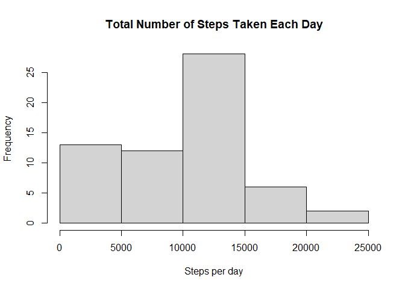
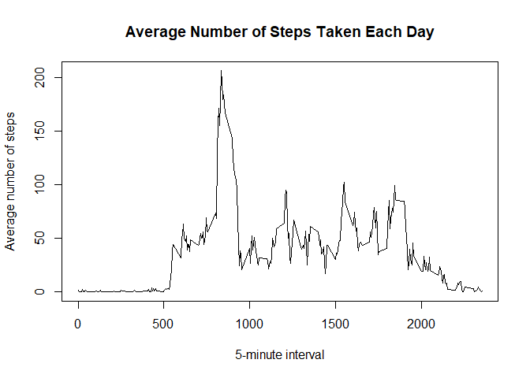
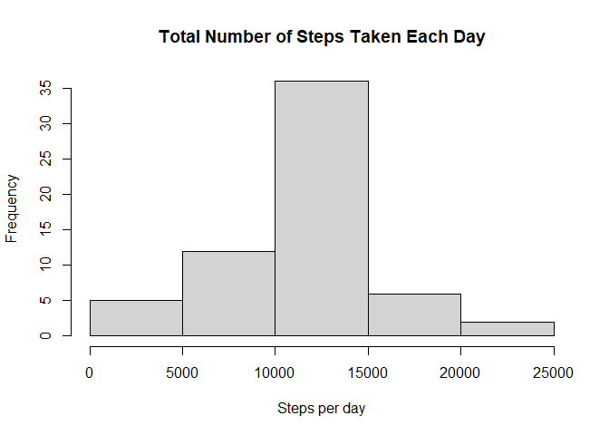
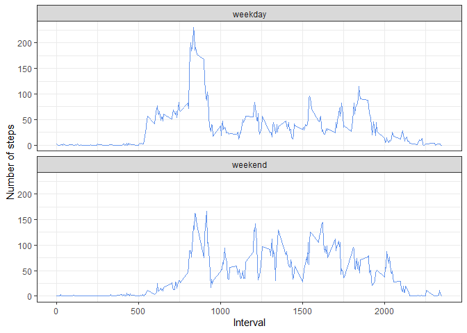

## Peer-graded Assignment 1
#### Name: Zachary Yong

## Loading and preprocessing the data

```r
library(tidyr)
# Load data
df <- as_tibble(read.csv(unz("activity.zip","activity.csv")))
# Check data
str(df)
```

```
## tibble [17,568 x 3] (S3: tbl_df/tbl/data.frame)
##  $ steps   : int [1:17568] NA NA NA NA NA NA NA NA NA NA ...
##  $ date    : chr [1:17568] "2012-10-01" "2012-10-01" "2012-10-01" "2012-10-01" ...
##  $ interval: int [1:17568] 0 5 10 15 20 25 30 35 40 45 ...
```

```r
head(df,5)
```

```
## # A tibble: 5 x 3
##   steps date       interval
##   <int> <chr>         <int>
## 1    NA 2012-10-01        0
## 2    NA 2012-10-01        5
## 3    NA 2012-10-01       10
## 4    NA 2012-10-01       15
## 5    NA 2012-10-01       20
```

```r
tail(df,5)
```

```
## # A tibble: 5 x 3
##   steps date       interval
##   <int> <chr>         <int>
## 1    NA 2012-11-30     2335
## 2    NA 2012-11-30     2340
## 3    NA 2012-11-30     2345
## 4    NA 2012-11-30     2350
## 5    NA 2012-11-30     2355
```

```r
# Convert to date class
df$date <- as.Date(df$date, "%Y-%m-%d")
```


## What is mean total number of steps taken per day?
#### 1. Make a histogram of the total number of steps taken each day

```r
library(dplyr)
```

```
## 
## Attaching package: 'dplyr'
```

```
## The following objects are masked from 'package:stats':
## 
##     filter, lag
```

```
## The following objects are masked from 'package:base':
## 
##     intersect, setdiff, setequal, union
```

```r
# Calculate total steps for each day
df2 <- df %>% 
        group_by(date) %>% 
        summarize(steps = sum(steps, na.rm=TRUE))
# Plot histogram
hist(df2$steps, xlab="Steps per day", main="Total Number of Steps Taken Each Day")
```

<!-- -->

#### 2. Calculate and report the mean and median total number of steps taken per day  

Mean:

```r
mean(df2$steps)
```

```
## [1] 9354.23
```
Median:

```r
median(df2$steps)
```

```
## [1] 10395
```


## What is the average daily activity pattern?
#### 1. Make a time series plot (i.e. type = "l") of the 5-minute interval (x-axis) and the average number of steps taken, averaged across all days (y-axis)

```r
# Calculate mean steps for interval
df3 <- df %>% 
        group_by(interval) %>% 
        summarize(steps = mean(steps, na.rm=TRUE))
# Plot time series
with(df3, plot(interval, steps, type="l", xlab="5-minute interval", 
               ylab="Average number of steps", 
               main="Average Number of Steps Taken Each Day"))
```

<!-- -->

#### 2. Which 5-minute interval, on average across all the days in the dataset, contains the maximum number of steps?

```r
df3$interval[df3$steps==max(df3$steps)]
```

```
## [1] 835
```


## Imputing missing values
#### 1. Calculate and report the total number of missing values in the dataset (i.e. the total number of rows with NAs)  

Total Number of missing values:

```r
table(is.na(df$steps))[2]
```

```
## TRUE 
## 2304
```
#### 2. Devise a strategy for filling in all of the missing values in the dataset. The strategy does not need to be sophisticated. For example, you could use the mean/median for that day, or the mean for that 5-minute interval, etc.  

Check the missing values for steps in the dataset

```r
head(df,5)
```

```
## # A tibble: 5 x 3
##   steps date       interval
##   <int> <date>        <int>
## 1    NA 2012-10-01        0
## 2    NA 2012-10-01        5
## 3    NA 2012-10-01       10
## 4    NA 2012-10-01       15
## 5    NA 2012-10-01       20
```

Calculate the number of missing values on 2012-10-01

```r
table(is.na(df$steps[df$date=="2012-10-01"]))
```

```
## 
## TRUE 
##  288
```

Strategy: Certain days as shown above contains only NAs, hence the mean can not be calculated. 

```r
mean(df$steps[df$date=="2012-10-01"],na.rm=TRUE)
```

```
## [1] NaN
```

Therefore, replacing missing values with mean for 5-minute interval (previously calculated in df3) would be the better option.

```r
head(df3,5)
```

```
## # A tibble: 5 x 2
##   interval  steps
##      <int>  <dbl>
## 1        0 1.72  
## 2        5 0.340 
## 3       10 0.132 
## 4       15 0.151 
## 5       20 0.0755
```

#### 3. Create a new dataset that is equal to the original dataset but with the missing data filled in.

```r
# Fill missing values with mean for 5-minute interval
df4 <- df
df4$steps <- ifelse(is.na(df$steps), df3$steps, df4$steps)
```

#### 4. Make a histogram of the total number of steps taken each day and Calculate and report the mean and median total number of steps taken per day. Do these values differ from the estimates from the first part of the assignment? What is the impact of imputing missing data on the estimates of the total daily number of steps?

```r
# Calculate total steps for each day
df5 <- df4 %>% 
        group_by(date) %>% 
        summarize(steps = sum(steps, na.rm=TRUE))
# Plot histogram
hist(df5$steps, xlab="Steps per day", main="Total Number of Steps Taken Each Day")
```

<!-- -->
Mean:

```r
mean(df5$steps)
```

```
## [1] 10766.19
```
Median:

```r
median(df5$steps)
```

```
## [1] 10766.19
```
Answer: 
Yes, they differ. The histogram has become more "centralized".


## Are there differences in activity patterns between weekdays and weekends?
#### 1. Create a new factor variable in the dataset with two levels -- "weekday" and "weekend" indicating whether a given date is a weekday or weekend day.

```r
df4 <- mutate(df4, dayType = ifelse(weekdays(date, abbr=TRUE) %in% c("Sat", "Sun"), "weekend", "weekday"))
```

#### 2. Make a panel plot containing a time series plot (i.e. type = "l") of the 5-minute interval (x-axis) and the average number of steps taken, averaged across all weekday days or weekend days (y-axis).

```r
# Calculate mean steps for interval
df6 <- df4 %>% 
        group_by(dayType,interval) %>% 
        summarize(steps = mean(steps, na.rm=TRUE))
```

```
## `summarise()` has grouped output by 'dayType'. You can override using the
## `.groups` argument.
```

```r
# Plot
library(ggplot2)
g <- ggplot(df6,aes(interval,steps))
g + geom_line(color="cornflowerblue") + facet_wrap(~dayType, ncol = 1) + 
        labs(x="Interval", y="Number of steps") + theme_bw()
```

<!-- -->
